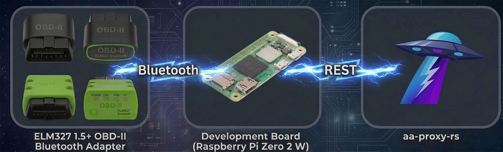

# 🚗 canze-rs

## How it works


## Description
This small Linux tool connects to an EV's CAN bus over a Bluetooth ELM327 OBD-II adapter and forwards live vehicle telemetry (battery, odometer, tire pressure) to a local REST endpoint, designed to be consumed by [`aa-proxy-rs`](https://github.com/aa-proxy/aa-proxy-rs) for Android Auto EV routing and dashboards.<br>

This repository is a fork of the original [`manio/canze-rs`](https://github.com/manio/canze-rs.git), generalised beyond the Renault Zoe into a multi-vehicle telemetry daemon driven by JSON profiles.
The name of the original project is inspired by (and a tribute to) the great [CanZE](https://canze.fisch.lu/) project.

## Supported vehicles
| Vehicle | Profile | SOC | Battery (Wh) | External temp | Odometer | Tire pressure |
|---|---|:---:|:---:|:---:|:---:|:---:|
| Renault Zoe | `zoe` | ✅ |  |  |  |  |
| Hyundai Ioniq 5 | `ioniq5` | ✅ | ✅ | ✅ | ✅ | ✅ |
| Kia EV6 | `ev6` | ✅ | ✅ | ✅ | ✅ | ✅ |
| MG4 | `mg4` | ✅ |  | ✅ |  |  |
| Kia Niro | `niro` | ✅ |  |  |  |  |

Adding a new vehicle requires no Rust changes — see [Adding a vehicle profile](#adding-a-vehicle-profile) below.

## What it transmits
canze-rs runs as a long-lived daemon. While the car's OBD dongle is in range and the car is awake (charging or driving), it polls the PIDs declared by the active profile and `POST`s the readings as JSON to three endpoints on `localhost`:

| Endpoint | Payload |
|---|---|
| `POST http://localhost/battery` | `battery_level_percentage`, `battery_level_wh`, `battery_capacity_wh`, `external_temp_celsius` (all optional) |
| `POST http://localhost/odometer` | `odometer_km`, `trip_km` (optional) |
| `POST http://localhost/tire-pressure` | `pressures_kpa[]` |

Only fields whose PIDs are declared in the active profile are populated; the rest are omitted from the JSON. If the profile reports SOC as a percentage and the config provides `battery_capacity_wh`, canze-rs derives `battery_level_wh` automatically.

## Usage
```
canze-rs 0.2.0

USAGE:
    canze-rs [OPTIONS]

OPTIONS:
    -c, --config <CONFIG>    Config file path [default: /etc/canze-rs.conf]
    -d, --debug              Enable debug info
    -h, --help               Print help information
    -V, --version            Print version information
```

## Config
The daemon reads its configuration from `/etc/canze-rs.conf`:

```
[general]
mac                  = 00:00:00:00:00:00  # Bluetooth OBD-II dongle MAC
car                  = ev6                # profile name; loaded from /etc/canze-rs/<car>.json
battery_capacity_wh  = 77400              # optional; enables derived battery_level_wh from SOC %
```

| Key | Required | Description |
|---|:---:|---|
| `mac` | yes | MAC address of the Bluetooth ELM327 dongle paired to the host. |
| `car` | yes | Profile name. canze-rs loads `/etc/canze-rs/<car>.json` at startup. |
| `battery_capacity_wh` | no | Usable pack capacity in watt-hours. When set, canze-rs computes `battery_level_wh = SOC × battery_capacity_wh` and forwards it to `/battery`. |

## Vehicle profiles
Profile JSONs ship in this repo under [`profiles/`](profiles/). At install time they need to be copied to `/etc/canze-rs/<name>.json` (e.g. `profiles/ev6.json` → `/etc/canze-rs/ev6.json`).

### Profile schema
```jsonc
{
  "name": "Hyundai Ioniq 5",       // display name (logged at startup)
  "pids": [
    {
      "ecu_tx": "7E4",             // request header
      "ecu_rx": "7EC",             // response filter
      "pid":    "220105",          // service+PID bytes (UDS / Mode 22 typical)
      "fields": [
        {
          "name":       "battery_level_percentage",
          "byte_index": 31,        // offset into the response payload; negative = from end
          "length":     1,         // bytes (1, 2 or 3)
          "multiplier": 0.5,       // raw * multiplier ...
          "offset":     0.0        // ... + offset = final value
        }
      ]
    }
  ]
}
```

Fields whose `name` is recognised by canze-rs are aggregated into the appropriate `POST`. Recognised names today:

- **Battery** — `battery_level_percentage`, `battery_level_wh`, `external_temp_celsius`
- **Odometer** — `odometer_km`, `trip_km`
- **Tire pressure** — `tire_fl_kpa`, `tire_fr_kpa`, `tire_rl_kpa`, `tire_rr_kpa`

### Adding a vehicle profile
1. Identify the OBD ECU TX/RX headers and the Mode 22 PID(s) for the parameters you want. The [CanZE](https://canze.fisch.lu/) project is an excellent reference.
2. Determine the byte offset, length, multiplier, and offset for each field within the response payload.
3. Drop a new JSON file under `profiles/` (and copy it to `/etc/canze-rs/<name>.json`).
4. Point `car = <name>` at it in `/etc/canze-rs.conf`.

No code changes required.

## Building
```
cargo build --release
```

For embedded / Buildroot integration, this repo includes a vendored cargo configuration that pins crate sources to a local `VENDOR/` directory — see [`.cargo/config.toml`](.cargo/config.toml). Populate `VENDOR/` with `cargo vendor` (online), then build offline.

## License
GPL-2.0. See [`LICENSE`](LICENSE).

## Credits
- Original [`manio/canze-rs`](https://github.com/manio/canze-rs.git) by Mariusz Białończyk — the Renault Zoe SOC logger this fork started from.
- The [CanZE](https://canze.fisch.lu/) project.
